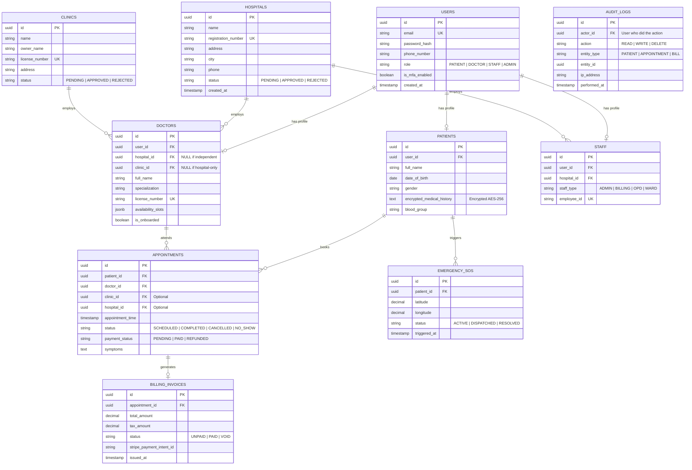

# MedConnect Backend System Design & Implementation Roadmap

This document outlines the architectural blueprint, technology choices, security guidelines, and development roadmap to build a production-grade, secure, and compliant backend for the **MedConnect** platform.

MedConnect is a multi-tenant healthcare system connecting patients, doctors, hospitals, clinics, and various hospital staff roles (OPD, Ward, Billing, Admin). Given the sensitive nature of medical data, security and regulatory compliance (e.g., HIPAA, GDPR) are foundational to this design.

---

## 1. System Architecture

The following diagram illustrates the proposed backend architecture, showcasing the relationship between the React frontend, the API Gateway, the application server, data storage, and external integrations.

```mermaid
graph TD
    %% Clients
    subgraph Client Tier [Client Tier]
        Web[React Web App]
        Mobile[Future Mobile App]
    end

    %% Edge
    subgraph Edge Layer [Edge Layer]
        DNS[Route 53 / DNS]
        CF[CloudFront CDN]
        WAF[AWS WAF / Firewall]
        GW[API Gateway / Nginx Reverse Proxy]
    end

    %% Services
    subgraph Application Tier [Application Tier (ECS / EKS)]
        Auth[Auth Service / MFA]
        Core[Core API Server - NestJS/Express]
        WS[WebSocket Server - Real-time SOS & Queues]
        Worker[Background Worker - Email/SMS/Reports]
    end

    %% Cache & Queue
    subgraph Event & Cache [Cache & Message Broker]
        Redis[(Redis Cache / WS PubSub / Queue)]
    end

    %% Data
    subgraph Data Tier [Data Tier]
        DB[(PostgreSQL Primary - Relational)]
        DBSync[(PostgreSQL Replica - Read Only)]
        S3[(AWS S3 Bucket - PHI Documents/Lab Reports)]
        KMS[AWS KMS - Field-level Encryption Keys]
    end

    %% Third-party
    subgraph External [External Services]
        Stripe[Stripe / Razorpay - PCI Payment]
        SMS[Twilio / SMS Gateway]
        Email[SES / SendGrid]
        AuditLog[SIEM / Elasticsearch & Kibana]
    end

    %% Connections
    Web --> DNS
    DNS --> CF
    CF --> WAF
    WAF --> GW
    GW --> Auth
    GW --> Core
    GW --> WS

    Core --> Redis
    WS --> Redis
    Worker --> Redis

    Core --> DB
    Core --> S3
    Core --> KMS
    Core --> Stripe
    Core --> Email
    Core --> SMS

    DB -.-> DBSync
    Core --> AuditLog
```

---

## 2. Technology Selection & Scenario Analysis

### Scenario A: Security & Healthcare Compliance (HIPAA / GDPR)

- **The Challenge**: Health platforms store **Protected Health Information (PHI)** and **Personally Identifiable Information (PII)**. Compromising this data leads to severe legal penalties and loss of trust.
- **Best Stack Choice**:
  - **Backend Framework**: **Node.js (NestJS with TypeScript)**. TypeScript aligns perfectly with the frontend React application, allowing the sharing of validation schemas (using [Zod](https://github.com/colinhacks/zod)). NestJS provides a structured architecture with built-in support for guards (for RBAC), interceptors (for logging), and exception filters.
  - **Primary Database**: **PostgreSQL** with **Row-Level Security (RLS)**. Medical structures are highly relational (Hospitals $\rightarrow$ Departments $\rightarrow$ Wards $\rightarrow$ Doctors/Staff $\rightarrow$ Appointments $\rightarrow$ Invoices). Postgres offers ACID transactions, strong typing, and superior relational integrity compared to NoSQL databases.
  - **Key Security Measures**:
    1.  **Field-Level Encryption**: Encrypt highly sensitive PHI columns (e.g., patient diagnoses, SSN/ID numbers) at the application level using `AES-256-GCM` before persisting to PostgreSQL. Use a Key Management Service (KMS) like AWS KMS or HashiCorp Vault to rotate encryption keys.
    2.  **Database Isolation**: Use schema separation or PostgreSQL Row-Level Security (RLS) to ensure that a clinic or hospital tenant can never view another tenant's data.
    3.  **Authentication & Session Management**:
        - JWT-based authentication with access tokens (short-lived, ~15 mins) and refresh tokens (stored in `HttpOnly`, `Secure`, `SameSite=Strict` cookies).
        - Multi-Factor Authentication (MFA) via TOTP (Google Authenticator) or SMS/Email OTP (crucial for medical staff and admin accounts).
    4.  **Transport & API Security**:
        - Force TLS 1.3 for all in-transit communications.
        - Use security headers via `Helmet` middleware.
        - Strict CORS policies limiting API access to recognized frontend domains.
        - Rate limiting via `express-rate-limit` and Redis to prevent Denial of Service (DoS) and brute force attacks.

### Scenario B: Auditing & Traceability

- **The Challenge**: HIPAA section §164.312(b) requires tracking all activities, updates, and accesses to patient PHI. We must know _who_ accessed _which_ patient record, _when_, and _what_ was modified.
- **Best Stack Choice**:
  - **Tech**: **Winston/Pino logger** + **Elasticsearch** (for analysis) or an **Immutable Audit Log table in PostgreSQL**.
  - **Implementation**:
    - Implement a NestJS/Express Middleware/Interceptor that intercepts any read/write request to PHI endpoints.
    - Log metadata: `timestamp`, `user_id`, `user_role`, `action` (READ, CREATE, UPDATE, DELETE), `target_entity_id`, and `ip_address`.
    - These logs must be sent to an isolated, append-only destination (e.g., AWS CloudWatch logs configured with Write Once Read Many (WORM) policies, or Elasticsearch).

### Scenario C: Real-Time SOS Alerts & Queue Management

- **The Challenge**: The SOS feature ([sos.jsx](file:///C:/react%20js%20Udemy%20course/medical-website-sinchan/MedConnect12/src/routes/sos.jsx)) requires immediate, low-latency transmission of geolocation and alert status to nearby hospitals/clinics and staff. OPD queues also require real-time updates.
- **Best Stack Choice**:
  - **Tech**: **WebSockets (`socket.io`)** paired with **Redis Pub/Sub** for horizontal scalability.
  - **Implementation**:
    - When a patient triggers an SOS alert, a WebSocket event is sent to the backend.
    - The backend calculates the closest clinics/hospitals using **PostgreSQL PostGIS** (for geographical queries) or a Redis geospatial index (`GEOSEARCH`).
    - The backend broadcasts the alert event to active staff members belonging to those target institutions.

### Scenario D: Payment Processing & Billing

- **The Challenge**: Handling billing for OPD appointments, ward stays, and lab tests ([staff.dashboard.billing.jsx](file:///C:/react%20js%20Udemy%20course/medical-website-sinchan/MedConnect12/src/routes/staff.dashboard.billing.jsx)).
- **Best Stack Choice**:
  - **Tech**: **Stripe** or **Razorpay** SDKs.
  - **Implementation**:
    - **Zero Card-Handling Policy**: The backend must never ingest, process, or store credit card details directly (ensuring PCI-DSS Compliance).
    - Use Stripe Checkout or Stripe Elements to capture payment information directly on the frontend. The backend only handles webhook verification to confirm invoices and mark appointments as paid.

---

## 3. Database Schema Design (PostgreSQL Entities)

Below is an entity-relationship schema designed to support the MedConnect routes:



---

## 4. Production-Ready Backend Development Flow

To build, test, and deploy this backend to a production-ready standard, follow this structured phases roadmap.

### Phase 1: Environment & Project Setup

1.  **Project Initialization**: Create a TypeScript NestJS project.
    ```bash
    npm i -g @nestjs/cli
    nest new medconnect-backend --package-manager npm
    ```
2.  **Linting & Quality**: Set up ESLint, Prettier, and Husky Git hooks to run tests and format checks before commit.
3.  **Database Connection**: Integrate Prisma ORM or TypeORM to handle migrations. Create PostgreSQL local containers using Docker Compose.
4.  **Environment Variables**: Create a strict `.env.validation` script (using `joi` or `zod`) to ensure essential variables are loaded (`DATABASE_URL`, `JWT_SECRET`, `KMS_KEY`, `STRIPE_SECRET`).

### Phase 2: Secure Core Engine (Authentication & RBAC)

1.  **JWT Auth**: Set up JWT authentication. Send access token as JSON and refresh token as an HttpOnly cookie.
2.  **MFA Implementation**: Use `otplib` to handle Google Authenticator enrollment and validation.
3.  **Role-Based Access Control (RBAC)**: Define custom NestJS Guards:
    - `@Roles(Role.Admin)`
    - `@Roles(Role.StaffBilling)`
    - `@Roles(Role.Doctor)`
    - Write middleware to verify that staff can only access data belonging to their specific `hospital_id`.

### Phase 3: Core API Implementations

1.  **Hospital & Doctor Onboarding**:
    - Create endpoints matching [hospital.register.jsx](file:///C:/react%20js%20Udemy%20course/medical-website-sinchan/MedConnect12/src/routes/hospital.register.jsx) and [doctor.onboarding.jsx](file:///C:/react%20js%20Udemy%20course/medical-website-sinchan/MedConnect12/src/routes/doctor.onboarding.jsx).
    - Implement file uploads (medical licenses, certificates) using secure presigned URLs pointing directly to **AWS S3** with virus scanning (using ClamAV).
2.  **Appointment Booking & Schedule Management**:
    - Implement scheduling and slot validation logic (prevent double-booking).
    - Enable patients to search for nearby clinics/doctors using geolocation query parameters.
3.  **Billing & Invoice Management**:
    - Implement endpoints for staff to generate bills ([staff.dashboard.billing.jsx](file:///C:/react%20js%20Udemy%20course/medical-website-sinchan/MedConnect12/src/routes/staff.dashboard.billing.jsx)).
    - Integrate Stripe Webhooks to safely process and register successful payments.

### Phase 4: WebSocket Real-Time Features & Audit Trails

1.  **SOS Gateway**:
    - Build a dedicated WebSocket Gateway using `@nestjs/websockets`.
    - Handle client authorization securely (ensure connection requests send a valid JWT in headers).
    - Broadcast coordinates to nearby hospital accounts using geographical queries.
2.  **OPD Queue Live-Track**:
    - Broadcast queue updates to patients and doctors real-time when patient status changes from `OPD Waiting` to `Doctor Cabin` (as managed on [staff.dashboard.opd.jsx](file:///C:/react%20js%20Udemy%20course/medical-website-sinchan/MedConnect12/src/routes/staff.dashboard.opd.jsx)).
3.  **Audit Logs Interceptor**:
    - Create a global interceptor that writes an entry to the `AUDIT_LOGS` table whenever patient details (`PATIENTS` database) are read or updated.

### Phase 5: Security Hardening & Compliance Audits

1.  **Data Sanitization & Injection Prevention**: Use Prisma/TypeORM parameterized queries. Run `dompurify`/`sanitize-html` on input fields.
2.  **Dependency Scanning**: Run `npm audit` or use Snyk/Dependabot to scan packages for vulnerabilities.
3.  **Field-level Encryption**: Programmatically encrypt and decrypt fields on read/write using application-level cryptography services.
4.  **Penetration Testing**: Execute basic DAST/SAST testing. Run OWASP ZAP scans against API endpoints.

### Phase 6: Cloud Deploy & Infrastructure (DevOps)

1.  **Containerization**: Write a optimized multi-stage `Dockerfile`.
2.  **Infrastructure as Code (IaC)**: Use Terraform to provision AWS resources:
    - **AWS ECS (Fargate)** or **AWS EKS (Kubernetes)** to run backend containers.
    - **Amazon RDS (PostgreSQL)** with Multi-AZ deployment for high availability.
    - **Amazon ElastiCache (Redis)**.
    - **AWS KMS** for encrypting data keys.
    - **IAM Roles** configured with the Principal of Least Privilege.
3.  **CI/CD Pipeline**: Setup GitHub Actions to run tests, build the Docker image, push it to Amazon ECR, and execute a rolling update to AWS ECS.

---

## 5. Summary Checklists

| Step  | Action Item                   | Target Verification                                 |
| ----- | ----------------------------- | --------------------------------------------------- |
| **1** | Initialize NestJS & Prisma    | `npm run build` succeeds locally                    |
| **2** | Establish Database Migrations | DB schema matches entity model                      |
| **3** | Secure Endpoints with JWT/MFA | Unauthorized requests return `401 Unauthorized`     |
| **4** | Encrypt Patient PHI Columns   | Verify columns in DB tables look like gibberish     |
| **5** | Implement Real-time SOS       | Active WebSocket connects and routes event triggers |
| **6** | Deploy to AWS Staging         | API tests pass against cloud endpoint               |
